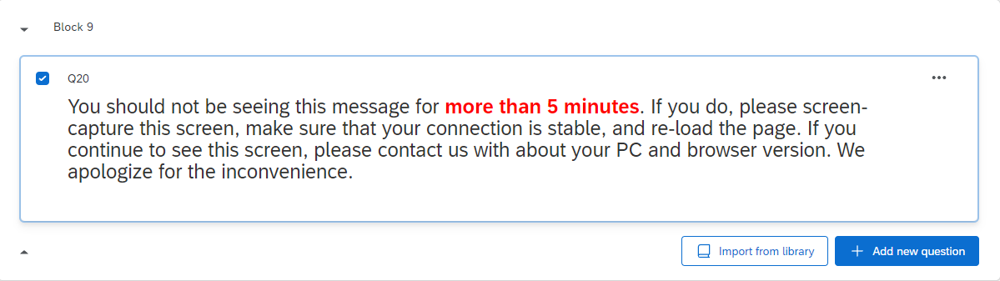
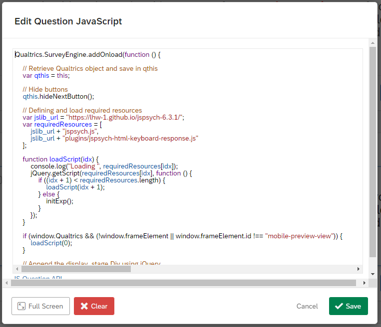

# Ambiguous-Scenarios-Task1-Qualtrics

This repository contains the instructions and code for implementing an **Ambiguous Scenarios Task (AST)** designed to be embedded into Qualtrics surveys.

This task measures interpretation bias by having participants read ambiguous scenarios, form mental images, and rate the pleasantness of their imagined outcomes. Based on the paradigm from Mathews & Mackintosh (2000) and Berna et al. (2011), it examines negative interpretation bias relevant to both depression and anxiety.

For any questions, please open new issues on this repository - and if you wish to contribute to the documentation or fix any errors, feel free to make a pull request.

## Task Overview

**Procedure:**

- Participants read 19 scenarios total (3 practice + 16 main task)
- Each scenario is presented once (participants advance manually when ready)
- After each scenario, participants rate pleasantness (1-9 scale) and describe their imagined outcome
- Main task includes depression-related and anxiety-related scenarios

**Measures:**

- Interpretation bias (pleasantness ratings of imagined outcomes)
- Qualitative data (participant descriptions of imagined outcomes)
- Response times for ratings and descriptions

## Embedding Instructions

The Ambiguous Scenarios Task can be embedded into a Qualtrics survey following the steps below.

### Adding the Task as a Question

To begin, create a new block in your survey by clicking **"Add Block"**.


After that, create a new question by clicking **"+ Add new question"**.


Once you click on the **"+ Add new question"** button, a dropdown will appear. Select the **"Text / Graphic"** option.


This will result in a template question, as shown below.


From here, hover above the **"Click to write the question text"**, and click on it. This should show you several more options.


From here, click on **"HTML View"** at the right corner. The following popup will appear.


Copy-and-paste the code in `code/index.html` into this box, and then click **"Save"**.


Once you have done so, the question should now look like this.



### Adding the Ambiguous Scenarios Task Code

Now, go to the left navigation bar. You should see several options like below (if you do not see them, try clicking on the question once more). Here, click on **"JavaScript"**.


The following popup will appear.


Delete all the code in here, copy-and-paste the code in `code/newIndex.js` into this box, and then click **"Save"**.



The code has been embedded successfully!

### Adding the Embedded Data

Now, the last thing to tackle is the data recording process. Go to the left navigation bar once more, and this time click on the second icon. This will take you to the **"Survey flow"** page.


The **"Survey flow"** page should look something like this. This is an example taken from a pre-existing survey; the question names were crossed out for privacy purposes.


Here, there should be a block for your Ambiguous Scenarios Task (or whatever it is named). On the block containing your Ambiguous Scenarios Task, click on **"Add Below"**.


This will popup.


Here, click on **"Embedded Data"**.


This will be the result of clicking on **"Embedded Data"**.


Here, what you need to do is to create 10 separate data entries named:

- `practice_pleasantness_ratings`
- `practice_outcome_descriptions`
- `practice_response_times`
- `main_pleasantness_ratings`
- `main_outcome_descriptions`
- `main_response_times`
- `main_scenario_ids`
- `main_scenario_themes`
- `list_assignment`
- `total_scenarios_completed`

When you do this, Qualtrics will automatically log these data, and it will be accessible through its `.csv` data file export. After you have included all data fields, it should look similar to this:


Remember to click on **"Apply"** at the bottom of the page.


And you're all set! Head back to the survey tab, and publish the survey.


## Data Output

The experiment collects the following data:

**Practice Phase Data:**

- `practice_pleasantness_ratings`: Pleasantness ratings for practice scenarios (1-9 scale, semicolon separated)
- `practice_outcome_descriptions`: Text descriptions of imagined outcomes (pipe | separated)
- `practice_response_times`: Response times in milliseconds (semicolon separated)

**Main Task Data:**

- `main_pleasantness_ratings`: Pleasantness ratings for main scenarios (1-9 scale, semicolon separated)
- `main_outcome_descriptions`: Text descriptions of imagined outcomes (pipe | separated)
- `main_response_times`: Response times in milliseconds (semicolon separated)
- `main_scenario_ids`: Scenario identification numbers (semicolon separated)
- `main_scenario_themes`: Theme categories (Self_Depression, Future_Depression, Uncertainty_Anxiety, etc., semicolon separated)
- `list_assignment`: Which stimulus list was used ("1" for List 1, "2" for List 2)
- `total_scenarios_completed`: Number of main scenarios completed successfully

**Rating Scale:**

- `1`: Extremely Unpleasant
- `2-8`: Intermediate ratings
- `9`: Extremely Pleasant

## Advanced Instructions

The code for the Ambiguous Scenarios Task is contained inside `code/newIndex.js` file.

**Customizing Scenarios:**
To modify scenarios, locate the `practiceScenarios` and `mainScenarios` arrays starting around line 123. Each main scenario follows this format:

```js
{
  text: "You are cooking dinner and taste a spoonful of your soup. The flavour is stronger than you expected.",
  theme: "Self",
  type: "Depression"
}
```

- `text`: The scenario text presented to participants
- `theme`: Theme category (Self, Future, Experiences, Uncertainty, Threat expectancy, Worry, Social evaluation)
- `type`: Type category (Depression or Anxiety)

**Customizing Timing:**

- Scenario display: Scenarios use manual advance with "Next" button - participants control pacing
- Rating phase: No time limit by default

**Customizing Stimuli Lists:**

This is AST 1 which uses Practice List 1 + Main List 1. For AST 2 implementation with Practice List 2 + Main List 2, see the AST 2 folder.
