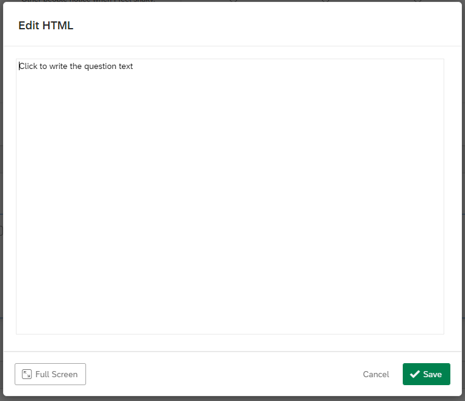

# Free-Viewing-Task-Qualtrics (Streamlined)

This repository contains the instructions and code for implementing a **Free Viewing Task** designed to be embedded into Qualtrics surveys.

This task measures attention patterns and visual preferences using emotional images (dysphoric, threat, positive, neutral) displayed in four screen quadrants. Participants complete a single-round free-viewing task where mouse cursor movements simulate eye tracking, with a "spotlight" effect revealing only the area around the cursor.

For any questions, please open new issues on this repository - and if you wish to contribute to the documentation or fix any errors, feel free to make a pull request.

## Task Overview

**Procedure:**

- Participants view 20 trials of image sets (12 emotional + 8 neutral filler trials)
- Each trial displays 4 images arranged in different screen quadrants
- Each trial lasts exactly 10 seconds with countdown timer
- Mouse cursor creates a 200px "spotlight" effect revealing image content
- Images are randomized in position across trials
- No explicit task requirements - natural viewing behavior

**Measures:**

- **Trial Data**: Trial-level metadata (trial type, images shown, positions, timing, round information)
- **Mouse Tracking**: Detailed cursor coordinates with timestamps and movement metrics
- **Participant Info**: Basic participant demographics and session details

## Image Categories

The task uses carefully selected emotional images:

- **Dysphoric**: Sad/depressive images (e.g., 2141.jpg, 2455.jpg, 9530.jpg)
- **Threat**: Threatening/fearful images (e.g., 1120.jpg, 6260.jpg, 6821.jpg)
- **Positive**: Pleasant/happy images (e.g., 1340.jpg, 2224.jpg, 4610.jpg)
- **Neutral**: Emotionally neutral images (e.g., 2038.jpg, 7185.jpg, 2745.1.jpg)
- **Fillers**: Additional neutral images for baseline trials

## Streamlined Structure

```
FVT_streamlined/
├── assets/           # Screenshots for documentation
│   ├── 1.PNG
│   ├── 2.PNG
│   └── ... (20 PNG files)
├── images/           # All 80 images in single folder
│   ├── 2141.jpg     # Emotional and filler images
│   ├── 1120.jpg
│   └── ...
├── code/
│   ├── index.html
│   └── newIndex.js   # Updated with simplified paths
└── README_FVT.md
```

## Embedding Instructions

The Free Viewing Task can be embedded into a Qualtrics survey following the steps below.

### Adding the Task as a Question

To begin, create a new block in your survey by clicking **"Add Block"**.


After that, create a new question by clicking **"+ Add new question"**.


Once you click on the **"+ Add new question"** button, a dropdown will appear. Select the **"Text / Graphic"** option.


This will result in a template question, as shown below.


From here, hover above the **"Click to write the question text"**, and click on it. This should show you several more options.


From here, click on **"HTML View"** at the right corner. The following popup will appear.



Copy-and-paste the code in `code/index.html` into this box, and then click **"Save"**.


Once you have done so, the question should now look like this.


### Adding the Free Viewing Task Code

Now, go to the left navigation bar. You should see several options like below (if you do not see them, try clicking on the question once more). Here, click on **"JavaScript"**.


The following popup will appear.


Delete all the code in here, copy-and-paste the code in `code/newIndex.js` into this box, and then click **"Save"**.


The code has been embedded successfully!

### Adding Images to Qualtrics

**IMPORTANT**: You need to upload all 80 images from the `images/` folder to your Qualtrics Graphics Library:

1. **Go to [Graphics Library](https://www.qualtrics.com/support/survey-platform/account-library/graphics-library/)** in your Qualtrics account
2. **Create a folder** called `images`
3. **Upload all 80 .jpg files** from the `images/` folder
4. **Update image paths** in the JavaScript code to use Qualtrics URLs

**Example path update:**

```js
// Current (local path):
"dysphoric": "images/2141.jpg"

// Update to (Qualtrics URL):
"dysphoric": "https://nus.au1.qualtrics.com/ControlPanel/Graphic.php?IM=IM_r6ex52fKAlbJ7FL"
```

### Adding the Embedded Data

Now, the last thing to tackle is the data recording process. Go to the left navigation bar once more, and this time click on the second icon. This will take you to the **"Survey flow"** page.


The **"Survey flow"** page should look something like this. This is an example taken from a pre-existing survey; the question names were crossed out for privacy purposes.


Here, there should be a block for your Free Viewing Task (or whatever it is named). On the block containing your Free Viewing Task, click on **"Add Below"**.


This will popup.


Here, click on **"Embedded Data"**.


This will be the result of clicking on **"Embedded Data"**.


Here, what you need to do is to create embedded data entries for:

**Basic Fields (4 entries):**
- `fvt_participant_id`
- `fvt_participant_info`
- `fvt_completion_stats`
- `fvt_trial_metadata`

**Mouse Data Fields (20 entries - one per trial):**
- `fvt_mouse_trial_1`
- `fvt_mouse_trial_2`
- `fvt_mouse_trial_3`
- ... (continue through)
- `fvt_mouse_trial_20`

**Total: 24 embedded data fields**

When you do this, Qualtrics will automatically log these data, and it will be accessible through its `.csv` data file export. After you have included all data fields, it should look similar to this:


Remember to click on **"Apply"** at the bottom of the page.


And you're all set! Head back to the survey tab, and publish the survey.


## Data Output

The experiment collects comprehensive data across 24 embedded data fields:

### Participant Information (`fvt_participant_info`)

Contains participant and session metadata as a JSON string:

```json
{
  "participant_id": "FVT_abc123",
  "session_id": "1",
  "start_time": "2024-01-15T10:30:00.000Z",
  "end_time": "2024-01-15T10:33:45.123Z",
  "browser_info": "Mozilla/5.0 (Windows NT 10.0; Win64; x64) AppleWebKit/537.36",
  "screen_resolution": "1920x1080"
}
```

### Trial Metadata (`fvt_trial_metadata`)

Contains detailed information about each trial as a JSON string:

```json
{
  "trials": [
    {
      "participant_id": "FVT_abc123",
      "session_id": "1",
      "trial_number": 1,
      "trial_type": "emotional",
      "trial_start_time": "2024-01-15T10:30:45.123Z",
      "trial_duration": 10000,
      "images_shown": ["url1", "url2", "url3", "url4"],
      "image_positions": {"dysphoric": "top-left", "threat": "top-right", "positive": "bottom-left", "neutral": "bottom-right"},
      "image_categories": {"dysphoric": "dysphoric", "threat": "threat", "positive": "positive", "neutral": "neutral"},
      "timestamp": "2024-01-15T10:30:45.123Z"
    }
  ]
}
```

### Mouse Tracking Data (Per Trial)

Each trial's mouse data is stored in a separate column (`fvt_mouse_trial_1` through `fvt_mouse_trial_20`) as JSON arrays:

**Example `fvt_mouse_trial_1`:**
```json
[
  {"t": 1250, "x": 640, "y": 480},
  {"t": 1300, "x": 645, "y": 485},
  {"t": 1350, "x": 650, "y": 490},
  {"t": 1400, "x": 655, "y": 495}
]
```

**Data Fields:**
- `t`: Milliseconds since trial start
- `x`: X-coordinate of cursor position  
- `y`: Y-coordinate of cursor position

**Benefits of Separate Columns:**
- Each trial's mouse data isolated in its own Excel column
- Prevents data overflow issues
- Allows trial-by-trial analysis
- Preserves all mouse movement data

### Completion Statistics (`fvt_completion_stats`)

Contains summary statistics as a JSON string:

```json
{
  "trials_completed": 20,
  "emotional_trials": 12,
  "filler_trials": 8,
  "total_mouse_events": 1250,
  "avg_events_per_trial": 62.5
}
```

### Participant ID (`fvt_participant_id`)

Unique participant identifier (string): `"FVT_abc123"`

## Data Analysis Recommendations

**For Mouse Tracking Analysis:**

- Use `timestamp_relative` to align mouse movements within trials
- Calculate fixation duration by analyzing periods of low mouse movement
- Analyze attention patterns by mapping mouse coordinates to image quadrant regions
- Examine viewing preferences across emotional image categories

**For Trial Analysis:**

- Compare viewing patterns between emotional vs. filler trials
- Analyze position effects (whether quadrant location influences viewing)
- Examine individual differences in emotional image preferences
- Calculate dwell time and revisits to different image categories

## Advanced Instructions

The code for the Free Viewing Task is contained inside `code/newIndex.js` file.

**Customizing Images:**
To modify the image sets, locate the `experimentConfig` object (starting around line 127). Each emotional trial follows this format:

```js
{
  "dysphoric": "images/2141.jpg",
  "threat": "images/1120.jpg",
  "positive": "images/1340.jpg",
  "neutral": "images/2038.jpg"
}
```

And each filler trial follows this format:

```js
{
  "filler1": "images/2235.jpg",
  "filler2": "images/7006.jpg",
  "filler3": "images/7010.jpg",
  "filler4": "images/5760.jpg"
}
```

**Customizing Timing:**

- Trial duration: Change `imageViewingTime: 10000` (line 131) for different trial lengths (currently 10 seconds = 10,000ms)
- Spotlight radius: Modify `spotlightRadius: 200` (line 132) to change the size of the reveal area (currently 200px)
- Number of trials: Adjust `numImageTrials: 12` and `numFillerItems: 8` (lines 129-130) to change trial counts

**Customizing Layout:**

- Image positions: Modify the `positions` array (lines 133-138) to change quadrant locations
- Image size: Change `.image-quadrant` CSS (lines 59-66) to adjust image dimensions (currently 300x300px)
- Spotlight effect: Modify the gradient calculation in `updateSpotlight()` function (lines 429-435) for different visual effects

**Adding New Image Categories:**
To add new emotional categories, modify both the image trial structure and ensure the data collection properly captures the new category labels in the `image_categories` field.
