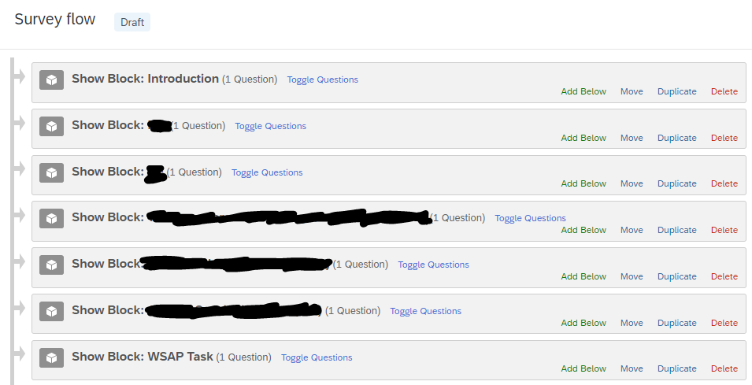

# Probes-Scenario-Task1-Qualtrics

This repository contains the instructions and code for implementing a **Probes Scenario Task (PST)** designed to be embedded into Qualtrics surveys.

This task measures cognitive processing biases by presenting participants with sequential story scenarios followed by word fragment completion tasks and comprehension questions. The task examines interpretation biases relevant to depression and anxiety through reaction time measurements and response accuracy.

For any questions, please open new issues on this repository - and if you wish to contribute to the documentation or fix any errors, feel free to make a pull request.

## Task Overview

**Procedure:**

- Participants complete 33 scenarios total (3 practice + 30 main task)
- Each scenario presents 3 sentences sequentially (2.5 seconds each) on white background
- After the third sentence, a word fragment appears requiring completion
- Participants press SPACEBAR when they know the word (reaction time measured)
- Participants type the complete word with spell-checking validation
- A comprehension question follows with Yes/No button response
- Feedback is provided for each comprehension answer
- Main task includes positive, depression-related, and anxiety-related scenarios

**Measures:**

- Reaction times for word fragment recognition
- Word completion accuracy (spell-checked against correct answers)
- Comprehension question accuracy
- Response patterns across different scenario types (positive, depression, anxiety)

## Embedding Instructions

The Probes Scenario Task can be embedded into a Qualtrics survey following the steps below.

### Adding the Task as a Question

To begin, create a new block in your survey by clicking **"Add Block"**.


After that, create a new question by clicking **"+ Add new question"**.


Once you click on the **"+ Add new question"** button, a dropdown will appear. Select the **"Text / Graphic"** option.


This will result in a template question, as shown below.


From here, hover above the **"Click to write the question text"**, and click on it. This should show you several more options.


From here, click on **"HTML View"** at the right corner. The following popup will appear.


Copy-and-paste the code in `code/index.html` into this box, and then click **"Save"**.


Once you have done so, the question should now look like this.


### Adding the Probes Scenario Task Code

Now, go to the left navigation bar. You should see several options like below (if you do not see them, try clicking on the question once more). Here, click on **"JavaScript"**.


The following popup will appear.


Delete all the code in here, copy-and-paste the code in `code/newIndex.js` into this box, and then click **"Save"**.


The code has been embedded successfully!

### Adding the Embedded Data

Now, the last thing to tackle is the data recording process. Go to the left navigation bar once more, and this time click on the second icon. This will take you to the **"Survey flow"** page.


The **"Survey flow"** page should look something like this. This is an example taken from a pre-existing survey; the question names were crossed out for privacy purposes.



Here, there should be a block for your Probes Scenario Task (or whatever it is named). On the block containing your Probes Scenario Task, click on **"Add Below"**.


This will popup.


Here, click on **"Embedded Data"**.


This will be the result of clicking on **"Embedded Data"**.


Here, what you need to do is to create 19 separate data entries named:

- `practice_reaction_times`
- `practice_word_accuracy`
- `practice_comprehension_accuracy`
- `practice_input_words`
- `practice_correct_words`
- `main_reaction_times`
- `main_word_accuracy`
- `main_comprehension_accuracy`
- `main_input_words`
- `main_correct_words`
- `main_scenario_types`
- `list_assignment`
- `practice_scenarios_completed`
- `main_scenarios_completed`
- `total_scenarios_completed`
- `device_info`
- `browser_type`
- `operating_system`
- `device_type`

When you do this, Qualtrics will automatically log these data, and it will be accessible through its `.csv` data file export. After you have included all data fields, it should look similar to this:


Remember to click on **"Apply"** at the bottom of the page.


And you're all set! Head back to the survey tab, and publish the survey.


## Data Output

The experiment collects the following data:

**Practice Phase Data:**

- `practice_reaction_times`: Reaction times for word fragment recognition in milliseconds (semicolon separated)
- `practice_word_accuracy`: Word completion accuracy (1 = correct, 0 = incorrect, semicolon separated)
- `practice_comprehension_accuracy`: Comprehension question accuracy (1 = correct, 0 = incorrect, semicolon separated)
- `practice_input_words`: Actual words typed by participants (semicolon separated)
- `practice_correct_words`: Expected correct answers (semicolon separated)

**Main Task Data:**

- `main_reaction_times`: Reaction times for word fragment recognition in milliseconds (semicolon separated)
- `main_word_accuracy`: Word completion accuracy (1 = correct, 0 = incorrect, semicolon separated)
- `main_comprehension_accuracy`: Comprehension question accuracy (1 = correct, 0 = incorrect, semicolon separated)
- `main_input_words`: Actual words typed by participants (semicolon separated)
- `main_correct_words`: Expected correct answers (semicolon separated)
- `main_scenario_types`: Scenario type categories (positive, depression, anxiety, semicolon separated)
- `list_assignment`: Which stimulus list was used ("1" for Practice 1 + List 1)

**Completion Tracking Data:**

- `practice_scenarios_completed`: Number of practice scenarios completed successfully
- `main_scenarios_completed`: Number of main scenarios completed successfully
- `total_scenarios_completed`: Total number of scenarios completed (practice + main)

**Device Information Data:**

- `device_info`: Complete device information as JSON string (user agent, platform, language, window size, timezone, etc.)
- `browser_type`: Browser name (Chrome, Firefox, Safari, Edge, Unknown)
- `operating_system`: Operating system (Windows, macOS, Linux, Android, iOS, Unknown)
- `device_type`: Device category (Desktop, Mobile, Tablet)

**Scoring:**

- **Reaction Times**: Faster times may indicate stronger automatic processing of scenario-congruent word fragments
- **Word Accuracy**: Measures attention and comprehension during task performance
- **Comprehension Accuracy**: Validates that participants are attending to and understanding the scenarios

## Advanced Instructions

The code for the Probes Scenario Task is contained inside `code/newIndex.js` file.

**Customizing Scenarios:**
To modify scenarios, locate the `practiceScenarios` and `mainScenarios` arrays starting around line 159. Each main scenario follows this format:

```js
{
  sentence1: "You company signs up for a volleyball tournament that starts next week. You…",
  sentence2: "are asked to be the captain. You lost your first match, so at the next…",
  sentence3: "training you address your team. You think that because of your speech, the team spirit will…",
  fragment: "incr_ _se",
  correctWord: "increase",
  question: "Do you think your speech discouraged your team?",
  correctAnswer: "no",
  type: "positive"
}
```

- `sentence1`, `sentence2`, `sentence3`: Sequential sentences presented for 2.5 seconds each
- `fragment`: Word fragment with underscores representing missing letters
- `correctWord`: Complete word for spell-checking validation
- `question`: Comprehension question about the scenario content
- `correctAnswer`: "yes" or "no" for the comprehension question
- `type`: Scenario category ("positive", "depression", "anxiety")

**Customizing Timing:**

- Sentence display duration: Each sentence displays for 2.5 seconds (lines 572, 581, 591)
- Word fragment phase: No time limit, participants press spacebar when ready
- Word input phase: No time limit, participants advance when form is complete
- Comprehension phase: No time limit, participants click Yes/No buttons

**Customizing Stimuli Lists:**

This is PST 1 which uses Practice 1 + List 1. For PST 2 implementation with Practice 2 + List 2, see the PST 2 folder.