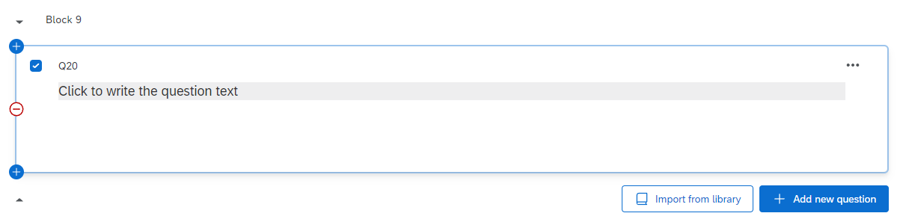
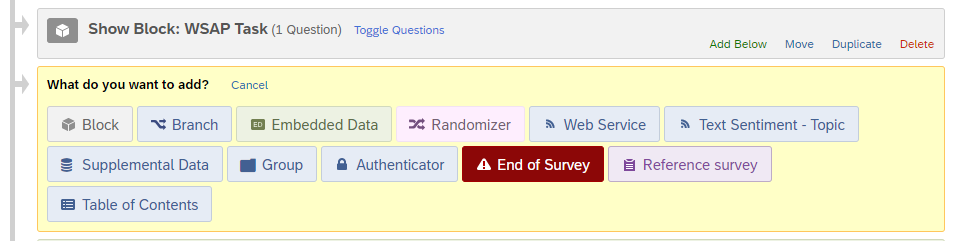
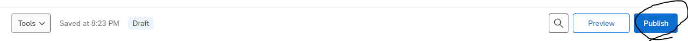

# Scrambled-Sentence-Task-Qualtrics

This repository contains the instructions and code for implementing a **Scrambled Sentence Task** with cognitive load component, designed to be embedded into Qualtrics surveys.

This task measures interpretation bias by having participants unscramble sentences that can be completed in either positive or negative ways. Based on the paradigm from Wenzlaff and Bates (1998, 2000), it includes cognitive load manipulation to examine automatic vs. controlled processing.

For any questions, please open new issues on this repository - and if you wish to contribute to the documentation or fix any errors, feel free to make a pull request.

## Task Overview

**Procedure:**

- Participants start with 3 practice sentences to familiarize themselves with the task
- Then unscramble 20 sentences in the main trials using 5 out of 6 scrambled words
- Each sentence can be completed in either a positive or negative way
- 4-minute time limit for the main trials with cognitive load manipulation
- 6-digit number memorization throughout the entire task

**Measures:**

- Interpretation bias (positive vs. negative sentence completions)
- Cognitive load performance (digit recall accuracy)
- Response times and completion rates under time pressure

## Embedding Instructions

The Scrambled Sentence Task can be embedded into a Qualtrics survey following the steps below.

### Adding the Task as a Question

To begin, create a new block in your survey by clicking **"Add Block"**.


After that, create a new question by clicking **"+ Add new question"**.


Once you click on the **"+ Add new question"** button, a dropdown will appear. Select the **"Text / Graphic"** option.


This will result in a template question, as shown below.



From here, hover above the **"Click to write the question text"**, and click on it. This should show you several more options.


From here, click on **"HTML View"** at the right corner. The following popup will appear.


Copy-and-paste the code in `code/index.html` into this box, and then click **"Save"**.


Once you have done so, the question should now look like this.


### Adding the Scrambled Sentence Task Code

Now, go to the left navigation bar. You should see several options like below (if you do not see them, try clicking on the question once more). Here, click on **"JavaScript"**.


The following popup will appear.


Delete all the code in here, copy-and-paste the code in `code/index.js` into this box, and then click **"Save"**.


The code has been embedded successfully!

### Adding the Embedded Data

Now, the last thing to tackle is the data recording process. Go to the left navigation bar once more, and this time click on the second icon. This will take you to the **"Survey flow"** page.


The **"Survey flow"** page should look something like this. This is an example taken from a pre-existing survey; the question names were crossed out for privacy purposes.


Here, there should be a block for your Scrambled Sentence Task (or whatever it is named). On the block containing your Scrambled Sentence Task, click on **"Add Below"**.


This will popup.



Here, click on **"Embedded Data"**.


This will be the result of clicking on **"Embedded Data"**.


Here, what you need to do is to create 13 separate data entries named:

- `cognitive_load_digits`
- `cognitive_load_recall`
- `cognitive_load_accuracy`
- `practice_sentence_completions`
- `practice_sentences`
- `practice_sentence_interpretations`
- `practice_completion_times`
- `practice_total_completed`
- `main_sentence_completions`
- `main_sentences`
- `main_sentence_interpretations`
- `main_completion_times`
- `main_total_completed`

When you do this, Qualtrics will automatically log these data, and it will be accessible through its `.csv` data file export. After you have included all data fields, it should look similar to this:


Remember to click on **"Apply"** at the bottom of the page.


And you're all set! Head back to the survey tab, and publish the survey.



## Data Output

The experiment collects the following data:

**Cognitive Load Measures:**

- `cognitive_load_digits`: The 6-digit number shown to participants
- `cognitive_load_recall`: Participant's attempted recall
- `cognitive_load_accuracy`: Whether recall was correct (1/0)

**Sentence Completion Data:**

**Practice Data:**

- `practice_sentence_completions`: Word ordering choices for practice sentences (e.g., "3,1,5,2,4;1,4,2,5,3;...")
- `practice_sentences`: Actual sentences constructed during practice (e.g., "I visit the theatre often;I expect to see snow;...")
- `practice_sentence_interpretations`: Classification of practice sentences
- `practice_completion_times`: Time in milliseconds per practice sentence
- `practice_total_completed`: Number of practice sentences completed

**Main Trials Data:**

- `main_sentence_completions`: Word ordering choices (e.g., "3,1,5,2,4;1,4,2,5,3;...")
- `main_sentences`: Actual sentences constructed by participants (e.g., "Life is good to me;I want to keep trying;...")
- `main_sentence_interpretations`: Classification as positive/negative_D/negative_GA/mixed/unclear
- `main_completion_times`: Time in milliseconds per sentence
- `main_total_completed`: Number of sentences finished within time limit

**Interpretation Classifications:**

- `positive`: Completed sentence contains only the positive word
- `negative_D`: Completed sentence contains only the negative word (Dysphoric category)
- `negative_GA`: Completed sentence contains only the negative word (General Anxiety category)
- `mixed`: Completed sentence contains both positive and negative words
- `unclear`: Completed sentence contains neither critical word

## Advanced Instructions

The code for the Scrambled Sentence Task is contained inside `code/index.js` file.

**Customizing Stimuli:**
To modify sentences, locate the `list1_sentences` array (main trials, starting around line 193) and `practice_sentences` array (practice rounds, starting around line 317). Each sentence follows this format:

```js
{
  words: ["Life", "is", "good", "cruel", "to", "me"],
  positive_word: "good",
  negative_word: "cruel",
  negative_category: "D"
}
```

- `words`: Array of 6 scrambled words (5 used + 1 distractor)
- `positive_word` / `negative_word`: Critical words for automatic classification of completed sentences
- `negative_category`: Category for the negative word ("D" for Dysphoric, "GA" for General Anxiety, "P" for Practice)

**Customizing Timing:**

- Main trials duration: Change `240000` (around line 784) for different time limits (currently 4 minutes = 240,000ms)
- Cognitive load display: Modify `trial_duration: 5000` (around line 395) to change how long the 6-digit number is shown (currently 5 seconds)
- Practice rounds have no time limit by design to allow familiarization
